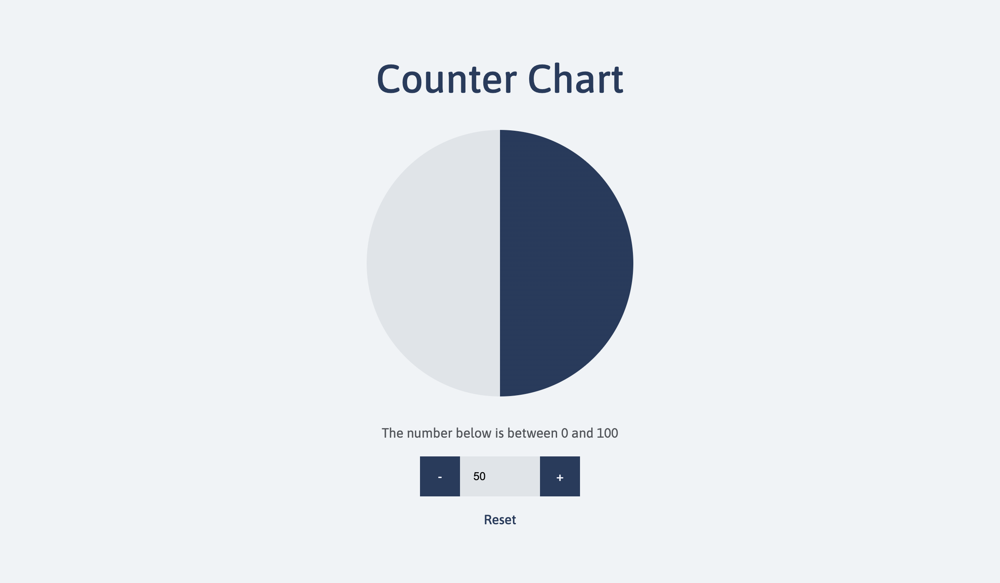

# Counter

Simple pie chart and number input demonstrating Redux Toolkit with TypeScript pattern.

---


## Demo

- <a href="https://counter-chart.netlify.app" target="_blank">counter-chart.netlify.app</a>

---


## Development

### 1. Initial install

Run the following in the project directory:

```bash
  npm install
```

Note: This project was created with node 20.6.1 and npm 9.8.1.


### 2. Run development server

```bash
  npm run dev
```

Open [localhost:5173](http://localhost:5173)

---


## Creation

This app was created using Vite with React/TypeScript using the following commands (run inside the project directory):

```bash
  npm create vite@latest .
  npm install
```


### Dependencies

#### Redux Toolkit

```bash
  npm install @reduxjs/toolkit react-redux
```

---


## Architecture

```
├── src/
│   ├── app/
│   │   - redux store, hooks, & counter slice
│   ├── assets/
│   │   ├── images/
│   │   │   - app screenshot
│   │   ├── styles/
│   │   │   - global styles
│   ├── components/
│   │   ├── common/
│   │   │   - page wrapper component
│   │   ├── counter/
│   │   │   - counter chart & input comoponents
│   ├── constants/
│   │   - counter default, max, & min values
└── readme.md
```
